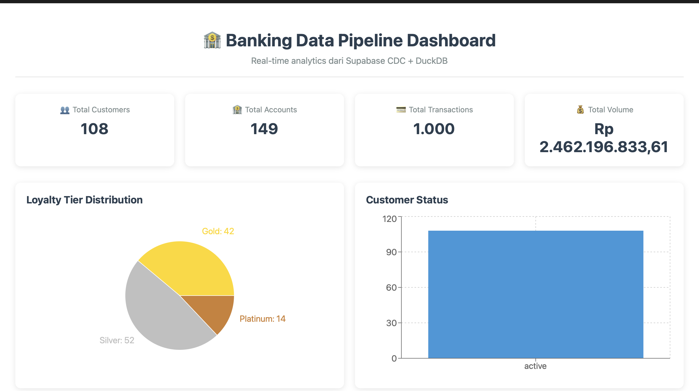
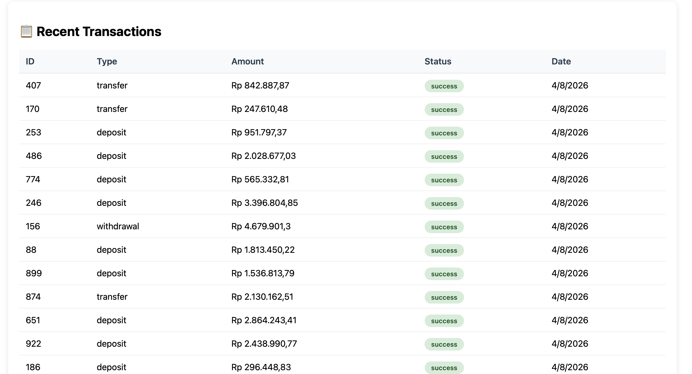

# 🏦 Modern Banking Data Pipeline

[](https://www.python.org/)
[](https://duckdb.org/)
[](https://supabase.com/)
[](https://reactjs.org/)
[](https://fastapi.tiangolo.com/)
[](LICENSE)

An **end-to-end modern data pipeline** for banking analytics, implementing **CDC (Change Data Capture)** from Supabase PostgreSQL, **Medallion Architecture** (Bronze-Silver-Gold), **SCD Type 2** for historical tracking, and an interactive **React dashboard** with real-time auto-refresh.

> 🔥 **Zero cloud cost** - Everything runs locally using DuckDB + Parquet!

---

## 📊 Architecture Overview
┌─────────────────┐ CDC ┌──────────────────┐ Parquet ┌─────────────────┐
│ │──────────────>│ │────────────────>│ │
│ SUPABASE │ Real-time │ CDC Consumer │ Raw Data │ BRONZE LAYER │
│ (PostgreSQL) │ WebSocket │ (Python) │ │ (Parquet Files) │
│ │<──────────────│ │ │ │
└─────────────────┘ └──────────────────┘ └────────┬────────┘
│
▼
┌─────────────────┐ DuckDB ┌──────────────────┐ DuckDB ┌─────────────────┐
│ │────────────────>│ │────────────────>│ │
│ SILVER LAYER │ Transformasi │ SCD Type 2 │ Star Schema │ GOLD LAYER │
│ (Cleaned Data) │ │ (Historical) │ │ (Dashboard) │
│ │<────────────────│ │<────────────────│ │
└─────────────────┘ └──────────────────┘ └────────┬────────┘
│
▼
┌─────────────────┐
│ REACT + │
│ FASTAPI │
│ Dashboard │
└─────────────────┘


---

## ✨ Key Features

| Feature | Description |
|---------|-------------|
| **⚡ Real-time CDC** | Capture every INSERT/UPDATE/DELETE from Supabase via WebSocket |
| **🏗️ Medallion Architecture** | Bronze (raw) → Silver (cleaned + SCD2) → Gold (star schema) |
| **📜 SCD Type 2** | Full historical tracking of customer and account changes |
| **📊 Star Schema** | `dim_customers`, `dim_accounts`, `dim_date`, `fact_transactions` |
| **📈 Interactive Dashboard** | React + FastAPI + Chart.js with auto-refresh every 30s |
| **💾 Zero Cloud Cost** | All data stored locally using DuckDB + Parquet |
| **🔍 Data Quality Tests** | Automated checks for duplicates, NULLs, referential integrity |

---

## 🛠️ Tech Stack

| Layer | Technology | Purpose |
|-------|------------|---------|
| **Source Database** | Supabase (PostgreSQL) | OLTP database with CDC capability |
| **CDC** | WebSocket + Python | Real-time change data capture |
| **Data Lake** | Parquet (Local Filesystem) | Immutable raw data storage |
| **Data Warehouse** | DuckDB | OLAP engine, transforms, and star schema |
| **Orchestration** | Python + APScheduler | Pipeline scheduling (optional) |
| **Backend API** | FastAPI | REST API for dashboard data |
| **Frontend** | React + Vite + Chart.js | Interactive real-time dashboard |

---

## 📂 Project Structure
\banking-data-pipeline/
├── scripts/
│ ├── data_generator.py # Generate synthetic banking data
│ ├── cdc_consumer.py # Real-time CDC from Supabase
│ ├── transform_duckdb.py # Bronze → Silver → Gold transforms
│ ├── load_initial.py # Initial data load from Supabase
│ └── dq_tests.sql # Data quality tests
├── backend/
│ └── main.py # FastAPI backend
├── frontend/
│ ├── src/
│ │ ├── App.jsx # React dashboard
│ │ └── App.css # Dashboard styles
│ └── package.json
├── data/
│ ├── bronze/ # Raw Parquet files
│ ├── silver/ # SCD Type 2 Parquet files
│ └── gold/ # Star Schema Parquet files
├── banking.duckdb # DuckDB database file
├── requirements.txt
├── .env
└── README.md


---

## 🚀 Quick Start

### Prerequisites

- Python 3.11+
- Node.js 18+
- Supabase account (free tier)
- Docker (optional, for Airflow)

### 1. Clone the Repository

```bash
git clone https://github.com/Pence420/banking-data-pipeline.git
cd banking-data-pipeline

2. Setup Python Environment

bash
python3 -m venv banking_env
source banking_env/bin/activate  # On Mac/Linux
# or banking_env\Scripts\activate  # On Windows

pip install -r requirements.txt
3. Configure Supabase

Create a .env file:

env
SUPABASE_URL=https://your-project.supabase.co
SUPABASE_API_KEY=your-anon-public-key
4. Enable Supabase Realtime

Go to Supabase Dashboard → Database → Replication
Toggle "Enable Realtime" ON
Add tables: customers, accounts, transactions
Set REPLICA IDENTITY FULL for each table:

sql
ALTER TABLE customers REPLICA IDENTITY FULL;
ALTER TABLE accounts REPLICA IDENTITY FULL;
ALTER TABLE transactions REPLICA IDENTITY FULL;
5. Generate Sample Data

bash
python3 scripts/data_generator.py
6. Run CDC Consumer

bash
python3 scripts/cdc_consumer.py
7. Run Initial Load (if data already exists)

bash
python3 scripts/load_initial.py
8. Run Transformations

bash
python3 scripts/transform_duckdb.py
9. Start Backend API

bash
cd backend
python3 main.py
# Backend runs on http://localhost:8000
10. Start Frontend Dashboard

bash
cd frontend
npm install
npm run dev
# Dashboard runs on http://localhost:5173
📊 Dashboard Screenshots




🔬 Data Quality Tests

Automated tests ensure data integrity:

sql
-- 1. Check for duplicate customer_id
SELECT COUNT(*) - COUNT(DISTINCT customer_id) FROM dim_customers;

-- 2. Check for NULL email
SELECT COUNT(*) FROM dim_customers WHERE email IS NULL;

-- 3. Check for invalid status
SELECT COUNT(*) FROM dim_customers WHERE status NOT IN ('active', 'inactive');

-- 4. Check for invalid loyalty tier
SELECT COUNT(*) FROM dim_customers WHERE loyalty_tier NOT IN ('Platinum', 'Gold', 'Silver');

-- 5. Check for valid foreign keys
SELECT COUNT(*) FROM fact_transactions f
LEFT JOIN dim_accounts a ON f.account_id = a.account_id
WHERE a.account_id IS NULL;
📈 Dashboard API Endpoints

Endpoint	Method	Description
/api/metrics	GET	KPI metrics (customers, accounts, transactions, volume)
/api/customers	GET	Full customer dimension data
/api/accounts	GET	Active accounts only
/api/transactions	GET	Recent transaction data
/api/loyalty	GET	Loyalty tier distribution
/api/status	GET	Customer status distribution
📈 Business Value

Aspect	Benefit
💰 Cost	Zero cloud cost - runs entirely locally
⚡ Speed	Real-time data availability (sub-second latency)
📊 Insights	Immediate visibility into customer behavior and trends
🔍 Audit	SCD Type 2 provides full change history for compliance
🔄 Reproducible	Full pipeline can be re-run from bronze layer
📱 Portable	Runs on any machine with Python + Node.js